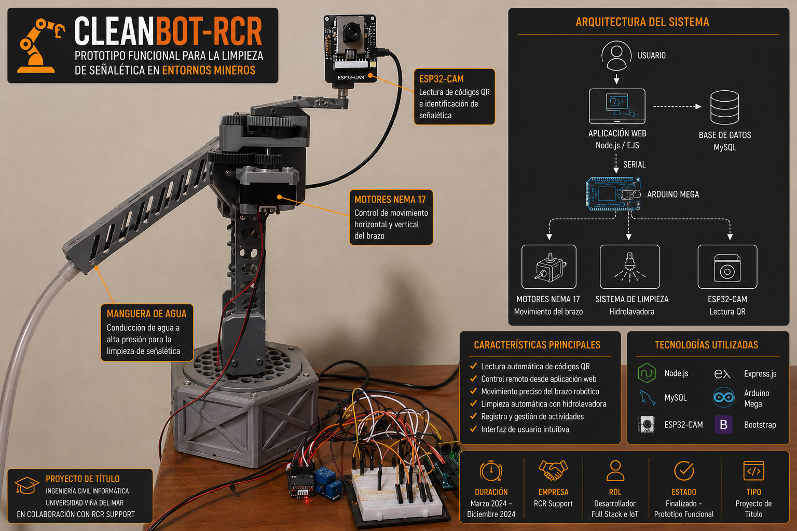

  

# 🚜 CleanBot-RCR

> Sistema Automatizado para la Limpieza de Señalética en Entornos Mineros

Proyecto de Título desarrollado para **RCR Support** en el marco de la carrera de Ingeniería Civil Informática de la Universidad Viña del Mar.

---

## 📖 Descripción

CleanBot-RCR es un sistema automatizado diseñado para reducir la exposición de los operadores mineros durante el proceso de limpieza de señaléticas. El proyecto integra una aplicación web, una base de datos y un sistema robótico capaz de identificar una señal mediante códigos QR y ejecutar el proceso de limpieza de forma asistida.

---

## 🎯 Objetivos

- Automatizar el proceso de limpieza de señaléticas.
- Reducir la exposición del operador a riesgos en terreno.
- Integrar hardware y software en una única solución.
- Validar el funcionamiento mediante un prototipo funcional.

---

## 🛠 Tecnologías

### Desarrollo Web

- Node.js
- Express.js
- JavaScript
- HTML
- Bootstrap
- EJS

### Base de Datos

- MySQL

### Hardware

- Arduino Mega
- ESP32-CAM
- ESP32
- Motores paso a paso NEMA 17
- Drivers A4988

### Herramientas

- Git
- GitHub
- Visual Studio Code

---

---

## 🚧 Estado del Proyecto

**Estado:** ✅ Finalizado — **Prototipo Funcional**

CleanBot-RCR fue desarrollado como **proyecto de título de Ingeniería Civil Informática** en colaboración con **RCR Support**.

El objetivo fue **diseñar, desarrollar e integrar un prototipo funcional** que demostrara la viabilidad técnica de automatizar la limpieza de señalética en entornos mineros mediante robótica, visión artificial e IoT.

El alcance del proyecto contempló:

- ✔ Diseño de la arquitectura del sistema.
- ✔ Desarrollo de la aplicación web.
- ✔ Integración con base de datos MySQL.
- ✔ Comunicación entre hardware y software.
- ✔ Construcción y validación del prototipo.
- ✔ Pruebas de funcionamiento en un entorno controlado.

> **Nota:** El código fuente no se encuentra publicado debido a que el proyecto fue desarrollado en colaboración con una empresa. Este repositorio tiene fines exclusivamente demostrativos y documenta el diseño, la arquitectura y los resultados obtenidos.

---